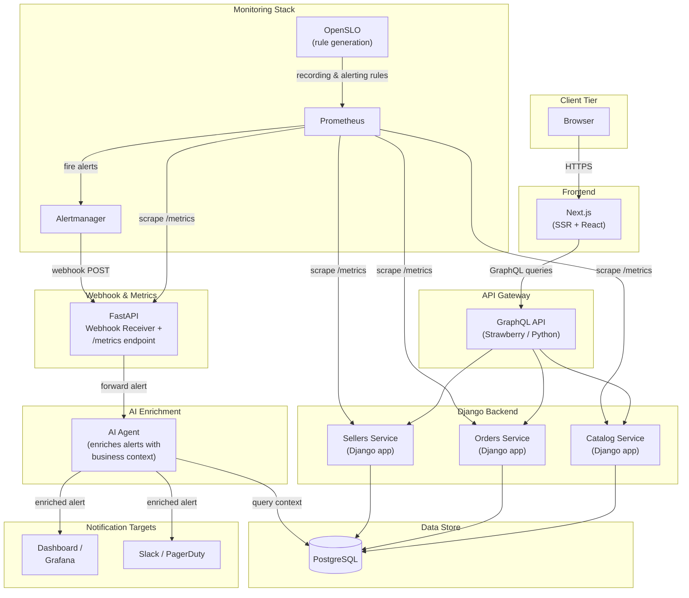

# System Architecture — Meridian Marketplace

Full-stack overview of the Meridian Marketplace platform showing user-facing services,
backend APIs, data stores, monitoring infrastructure, and the AI enrichment agent.

## Legend

| Symbol | Meaning |
|--------|---------|
| Rounded box | Application service |
| Cylinder | Database |
| Solid arrow | Data / request flow |
| Subgraph | Deployment boundary or logical grouping |
| `/metrics` | Prometheus-compatible scrape endpoint |
