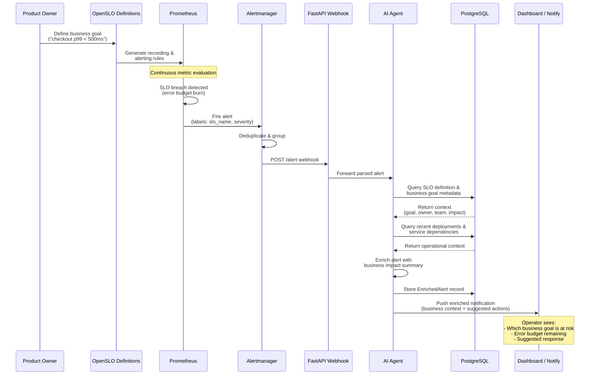

# SLO Business Flow — Meridian Marketplace

Sequence diagram showing the full lifecycle: a business goal drives an SLO definition,
Prometheus detects a breach, the AI agent enriches the alert with business context,
and operators receive an actionable notification.

## Legend

| Symbol | Meaning |
|--------|---------|
| Solid arrow (`->>`) | Synchronous request / action |
| Dashed arrow (`-->>`) | Response / return data |
| Note | Contextual annotation |
| Participant | System component or role |
