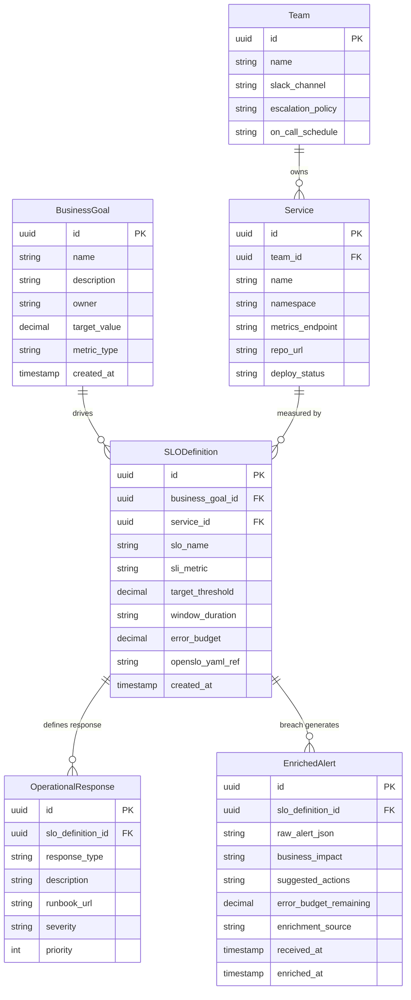

# Data Model — Meridian Marketplace

Entity-relationship diagram for the core domain objects that connect business goals
to operational alerts through SLO definitions, services, and teams.

## Legend

| Symbol | Meaning |
|--------|---------|
| `PK` | Primary key |
| `FK` | Foreign key |
| `\|\|--o{` | One-to-many relationship |
| Entity box | Database table / Django model |
