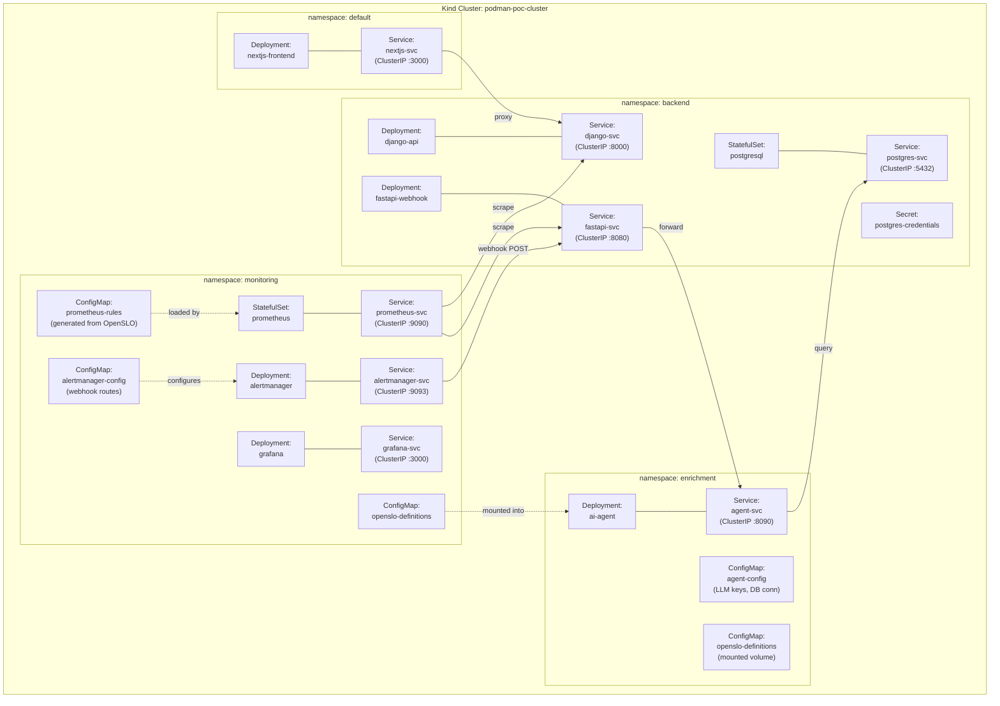

# Deployment Topology — Meridian Marketplace

Kubernetes deployment layout showing namespaces, workloads, services, and ConfigMaps
for the Meridian Marketplace platform running on a Kind cluster.

## Legend

| Symbol | Meaning |
|--------|---------|
| Solid line (`---`) | Resource association within a namespace |
| Solid arrow (`-->`) | Network traffic between services |
| Dashed arrow (`-.->`) | Configuration mount / injection |
| Subgraph | Kubernetes namespace |
| Rounded box | Kubernetes workload or resource |
