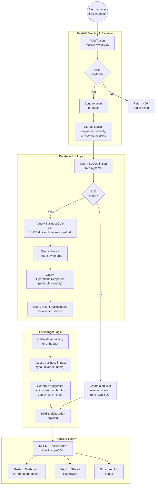

# Enrichment Pipeline — Meridian Marketplace

Detailed flowchart of the alert enrichment pipeline: from raw Alertmanager webhook
through parsing, database lookups, AI enrichment, persistence, and notification.

## Legend

| Symbol | Meaning |
|--------|---------|
| Double circle | External trigger (entry point) |
| Rectangle | Processing step |
| Diamond | Decision / branch |
| Subgraph | Pipeline stage |
| Solid arrow | Control flow |
