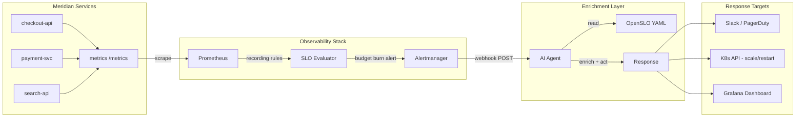
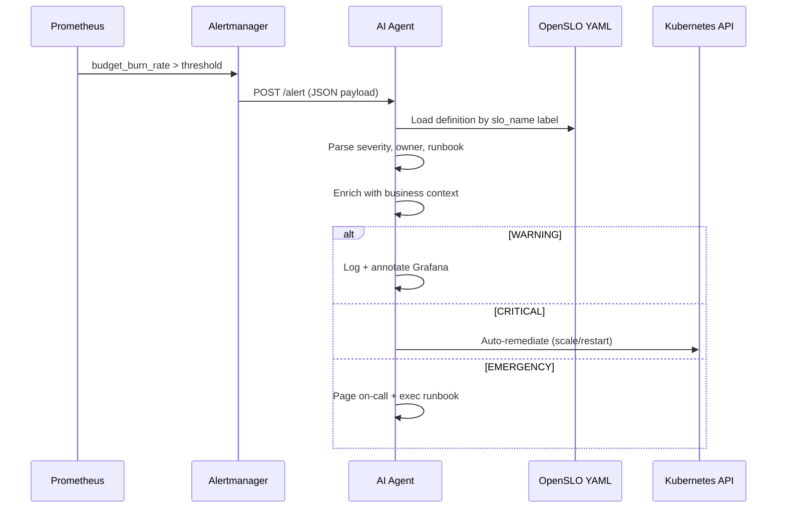

# Enriched Alerts
## SLO-Driven Observability for Meridian Marketplace

**From alert fatigue to business-aware operations**

---

## The Problem

### Alert fatigue is real

- Teams drown in **thousands of alerts/day** — most lack context
- "CPU at 87%" tells you *nothing* about business impact
- Operators context-switch between dashboards, runbooks, Slack threads
- Mean Time to Understand (MTTU) dominates incident timelines

### No business context

- Raw infrastructure metrics are **disconnected from revenue**
- A 500ms latency spike on checkout ≠ 500ms on the about page
- Alert routing has no concept of *who cares* or *how much it costs*
- Runbooks rot because they aren't tied to living SLO definitions

---

## The Principle

### SLOs as the Business API to Operations

- **SLIs** = raw signal (latency, error rate, throughput)
- **SLOs** = business boundary ("99.5% of checkouts < 400ms")
- **Error budget** = how much failure the business tolerates

### The pipeline

```
data  →  detection boundary  →  agent  →  response
 SLI         SLO breach          AI       enriched action
```

- SLOs encode *business intent* — not infrastructure opinion
- Alerts fire on **budget burn**, not arbitrary thresholds
- Responses are **graduated** — proportional to business risk

---

## Meridian Marketplace

### A fictional e-commerce platform

- Mid-size online retailer, **~50 microservices**
- Revenue: checkout, search, recommendations, inventory
- Peak traffic: holiday sales, flash promotions
- Team: 3 SREs covering all services

### Why this example?

- Realistic blast radius — not everything is equally critical
- Clear mapping: **service health → revenue impact**
- Multiple SLO profiles across the stack
- Small team = must automate or drown

---

## Business Goals → SLOs

| Business Goal | Service | SLI | SLO Target | Window |
|---|---|---|---|---|
| Checkout never blocks | `checkout-api` | p99 latency | < 400ms | 5 min |
| Payments succeed | `payment-svc` | Error rate | < 0.1% | 1 hr |
| Search feels instant | `search-api` | p95 latency | < 200ms | 5 min |
| Products load | `catalog-svc` | Availability | 99.9% | 1 hr |
| Cart persists | `cart-svc` | Error rate | < 0.5% | 30 min |
| Recs drive upsell | `reco-engine` | p90 latency | < 500ms | 15 min |

Each SLO is an **OpenSLO YAML file** in version control.

---

## Architecture



---

## Enrichment Pipeline

### What happens when an SLO breaches



- Alert payload carries `slo_name` label → agent looks up YAML
- YAML contains owner, description, runbook URI, severity tiers
- Agent **enriches** the alert with business context before acting

---

## Dashboard Mockup

### Meridian SLO Overview — Grafana

```
┌─────────────────────────────────────────────────┐
│  MERIDIAN MARKETPLACE — SLO STATUS        [24h] │
├────────────┬────────────┬───────────────────────┤
│ checkout   │ ██████████ │ Budget: 94.2%  ✅     │
│ payment    │ ██████████ │ Budget: 99.8%  ✅     │
│ search     │ ██████░░░░ │ Budget: 61.3%  ⚠️     │
│ catalog    │ ██████████ │ Budget: 98.1%  ✅     │
│ cart       │ ████░░░░░░ │ Budget: 42.7%  🔴     │
│ reco       │ █████████░ │ Budget: 88.5%  ✅     │
├────────────┴────────────┴───────────────────────┤
│ Burn Rate Alerts (last 1h)                      │
│  ⚠️  search-api: 2x burn on p95 latency         │
│  🔴 cart-svc: 5x burn on error rate             │
├─────────────────────────────────────────────────┤
│ Agent Actions (last 1h)                         │
│  → cart-svc: scaled replicas 3→5 (auto)         │
│  → search-api: annotated, notified #search-team │
└─────────────────────────────────────────────────┘
```

---

## Operational Responses

### Graduated tiers — proportional to business risk

**WARNING** — budget burn rate 2x–5x
- Enrich alert with SLO context + recent deploys
- Annotate Grafana dashboard
- Post to team channel with suggested investigation

**CRITICAL** — budget burn rate 5x–10x
- All WARNING actions, plus:
- Auto-remediate: `kubectl scale` or `kubectl rollout restart`
- Attach diagnostic output (pod logs, resource usage)
- Create incident ticket

**EMERGENCY** — budget burn rate >10x or budget exhausted
- All CRITICAL actions, plus:
- Page on-call via PagerDuty
- Execute full runbook from SLO definition
- Freeze deployments to the affected service

---

## Flat File Strategy

### SLO definitions as YAML — GitOps native

```yaml
# slos/checkout-latency.yaml
apiVersion: openslo/v1
kind: SLO
metadata:
  name: checkout-latency
  labels:
    team: checkout
    tier: critical
spec:
  service: checkout-api
  indicator:
    type: latency
    metric: http_request_duration_seconds
    threshold: 0.4   # 400ms
    percentile: 99
  objective:
    target: 0.995    # 99.5%
    window: 5m
  alerting:
    burnRate: [2, 5, 10]
    runbook: https://wiki.meridian.dev/checkout-latency
```

- **Git = source of truth** — PR review for SLO changes
- Agent reads YAML at alert time — always current
- No database, no API — just files on a ConfigMap
- `openslo generate` → Prometheus recording + alerting rules

---

## Demo Architecture

### Kind cluster topology

```mermaid
graph TB
    subgraph Kind Cluster - podman-poc-cluster
        subgraph monitoring namespace
            PR[Prometheus]
            AM[Alertmanager]
            GF[Grafana]
        end

        subgraph default namespace
            ES[example-service<br/>Flask + prom_client]
            EX[exerciser<br/>Python script]
        end

        subgraph agent namespace
            AG[AI Agent<br/>FastAPI webhook]
            CM[ConfigMap<br/>OpenSLO YAMLs]
        end
    end

    EX -->|generate load| ES
    ES -->|/metrics| PR
    PR -->|alert rules| AM
    AM -->|POST /alert| AG
    AG -->|read| CM
    AG -->|kubectl| ES

    U[Developer] -->|make all| Kind Cluster - podman-poc-cluster
    U -->|port-forward| GF
```

- `make kind-up` → cluster
- `make monitoring-up` → Prometheus + Alertmanager + Grafana
- `make agent-deploy` + `make service-deploy` → workloads
- Exerciser script triggers SLO breaches on demand

---

## Key Takeaways

- **SLOs encode business intent** — alerts mean something to stakeholders, not just ops
- **Enrichment bridges the gap** — raw alert + SLO context = actionable intelligence
- **Graduated response prevents overreaction** — WARNING/CRITICAL/EMERGENCY tiers match business risk
- **Flat files keep it simple** — YAML in Git, no platform lock-in, PR-reviewable SLO changes

---

## Next Steps

### Near term
- Deploy the PoC stack (Tasks 1–4)
- Validate the enrichment pipeline end-to-end
- Build real Grafana dashboards from SLO metrics

### Future
- ML-based anomaly detection on burn rate trends
- Cross-service SLO correlation (checkout depends on payment)
- Cost attribution — tie SLO breaches to revenue impact
- Self-tuning SLO thresholds from historical data

### Q&A

**Repository:** enriched-alert
**Stack:** Kind + Podman | Prometheus | Alertmanager | OpenSLO | FastAPI
