# System Overview

High-level architecture of the AI-driven SLO monitoring PoC. All components run inside a local Kind Kubernetes cluster (Podman runtime). Prometheus collects metrics and evaluates SLO-derived rules, Alertmanager routes breach alerts via webhook to an AI Agent, and the AI Agent enriches alerts with OpenSLO context.

```mermaid
graph TD
    subgraph kind["Kind K8s Cluster (Podman)"]

        subgraph svc["Example Service Pod"]
            ES["Example Service<br/>/metrics endpoint"]
        end

        subgraph mon["Monitoring Namespace"]
            PROM["Prometheus"]
            RULES["PrometheusRules<br/>(SLO Recording + Alerting)"]
            AM["Alertmanager"]
        end

        subgraph agent["AI Agent Pod"]
            AI["AI Agent<br/>(Webhook Receiver)"]
        end

        OSLO["OpenSLO ConfigMap<br/>(SLO Definitions YAML)"]

        ES -- "/metrics scrape" --> PROM
        PROM -- "evaluates" --> RULES
        RULES -- "fires alerts" --> AM
        AM -- "POST /alert webhook" --> AI
        AI -. "reads SLO context" .-> OSLO
    end

    style kind fill:#f0f4ff,stroke:#4a6fa5,stroke-width:2px
    style svc fill:#e8f5e9,stroke:#388e3c
    style mon fill:#fff3e0,stroke:#f57c00
    style agent fill:#e3f2fd,stroke:#1976d2
    style OSLO fill:#f3e5f5,stroke:#7b1fa2
```

## Legend

| Symbol | Meaning |
|---|---|
| Solid arrow (`-->`) | Active data flow (scrape, alert fire, webhook POST) |
| Dashed arrow (`-.->`) | Read / lookup (AI Agent reads OpenSLO definitions) |
| Green box | Application workload (Example Service) |
| Orange box | Monitoring infrastructure (Prometheus, Alertmanager, Rules) |
| Blue box | AI Agent |
| Purple box | Configuration (OpenSLO SLO definitions) |
| Outer blue border | Kind K8s cluster boundary |

## Data Flow Summary

1. **Prometheus** scrapes the Example Service `/metrics` endpoint on a configured interval.
2. **PrometheusRules** (generated from OpenSLO definitions) evaluate SLI recording rules and SLO alerting thresholds.
3. When an SLO breach is detected, Prometheus **fires an alert** to Alertmanager.
4. **Alertmanager** deduplicates, groups, and routes the alert via HTTP webhook POST to the AI Agent.
5. The **AI Agent** receives the alert payload, extracts the `slo_name` label, and reads the matching **OpenSLO ConfigMap** to enrich the alert with SLO context.
