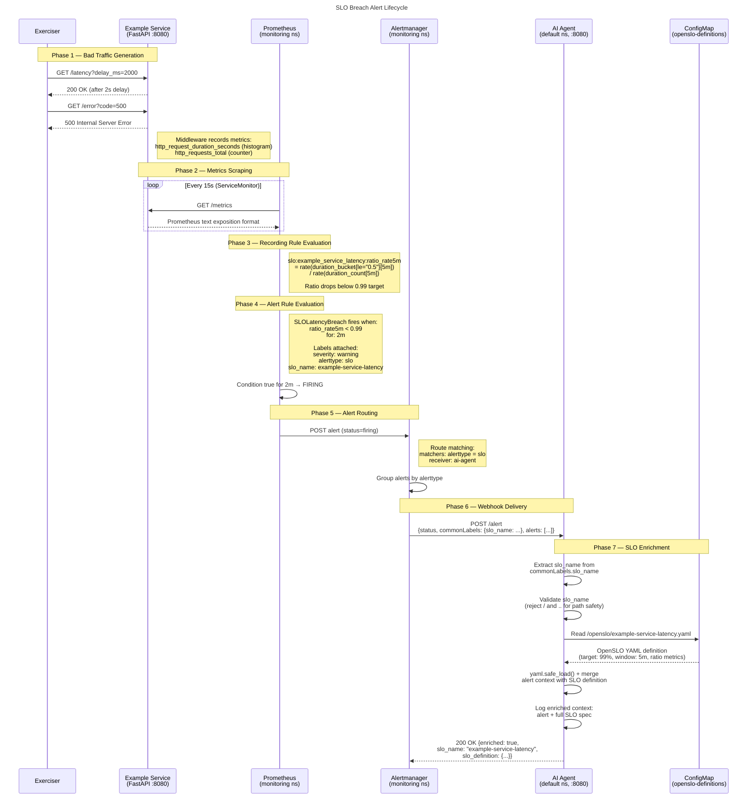

# SLO Breach Alert Flow

Full lifecycle of an SLO breach — from bad traffic through detection, alerting, and AI-driven enrichment.

## Sequence Diagram

## Notes

- **Timing**: The full cycle from first bad request to enriched log takes roughly **5–7 minutes** in practice — dominated by the 5-minute rate window filling plus the 2-minute `for:` duration on the alert rule.
- **Two alert types**: The same flow applies to both `SLOLatencyBreach` (latency > 500ms) and `SLOErrorRateBreach` (error rate > 1%). Each carries its own `slo_name` label pointing to a different OpenSLO YAML file.
- **ConfigMap mount**: The `openslo-definitions` ConfigMap is created from the `openslo/` directory and mounted at `/openslo` in the AI Agent pod. The agent resolves `{OPENSLO_DIR}/{slo_name}.yaml`.
- **Security**: The agent rejects `slo_name` values containing `/` or `..` to prevent path traversal, and uses `yaml.safe_load()` instead of `yaml.load()`.
- **Alertmanager grouping**: Alerts with `alerttype=slo` are routed to the `ai-agent` receiver. All other alerts fall through to the `default` receiver.
- **send_resolved**: Alertmanager is configured with `send_resolved: true`, so the agent also receives a notification when the SLO recovers.
- **Namespace boundaries**: Prometheus and Alertmanager run in the `monitoring` namespace; Example Service and AI Agent run in `default`. The webhook URL crosses namespaces via `ai-agent.default.svc.cluster.local`.
