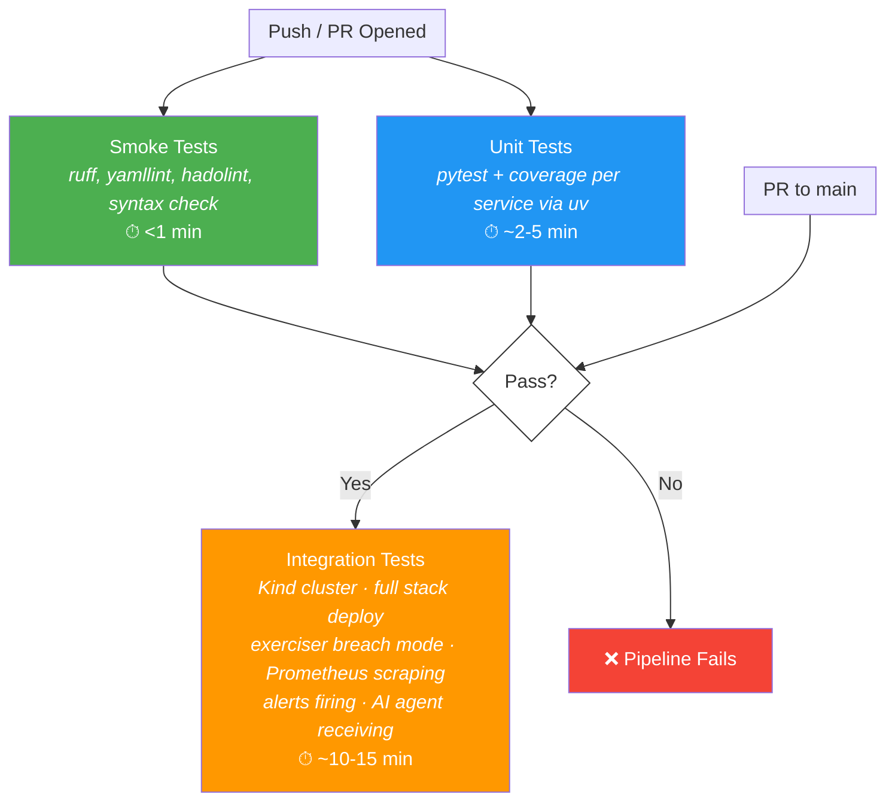
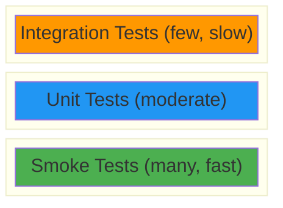

# CI/CD Pipeline — Test Pyramid

The CI/CD pipeline is structured as a test pyramid: many fast checks at the base, fewer slow checks at the top. Each layer gates the next — failures block promotion.

## Pipeline Triggers

| Trigger | Stages Run |
|---------|-----------|
| Push to any branch / PR opened | Smoke Tests, Unit Tests |
| PR merged to `main` | Integration Tests |

## Test Pyramid

## Pyramid View

## Stage Details

### Smoke Tests — Base of the Pyramid

Runs on every push and PR. Fast linters and syntax validators that catch obvious mistakes before anything else runs.

| Check | Tool | What it catches |
|-------|------|----------------|
| Python lint | `ruff` | Style violations, unused imports, basic errors |
| YAML lint | `yamllint` | Malformed Kubernetes manifests, OpenSLO defs |
| Dockerfile lint | `hadolint` | Dockerfile anti-patterns, pinning issues |
| Syntax check | `python -m py_compile` | Import errors, syntax errors |

**Target:** <1 minute total.

### Unit Tests — Middle of the Pyramid

Runs on every push and PR, in parallel with smoke tests. Per-service `pytest` suites executed via `uv` with coverage enforcement.

| Aspect | Detail |
|--------|--------|
| Runner | `uv run pytest` per service |
| Coverage | `pytest-cov`, enforced per service |
| Threshold | **80% line coverage minimum** |
| Services | `ai-agent`, `example-service`, `exerciser` |
| Isolation | Each service tested independently with mocked dependencies |

**Target:** ~2-5 minutes.

### Integration Tests — Top of the Pyramid

Runs only when a PR targets `main`. Spins up a real Kind cluster, deploys the full stack, and exercises the end-to-end alert pipeline.

| Step | What happens |
|------|-------------|
| 1. Cluster up | Kind cluster created with Podman runtime |
| 2. Deploy monitoring | Prometheus + Alertmanager via kube-prometheus-stack Helm chart |
| 3. Deploy services | Example service + AI agent loaded and deployed |
| 4. Exerciser breach mode | Exerciser script induces latency/error SLO breaches |
| 5. Verify Prometheus scraping | Assert metrics are being collected from example service |
| 6. Verify alerts firing | Assert Alertmanager has received SLO breach alerts |
| 7. Verify AI agent receiving | Assert AI agent webhook received and logged alert + OpenSLO context |
| 8. Teardown | Kind cluster deleted |

**Target:** ~10-15 minutes.

## Notes

- Smoke and unit tests run **in parallel** on push/PR to minimize wall-clock time.
- Integration tests are expensive (Kind cluster lifecycle) so they only run on PR-to-main.
- The 80% coverage threshold is per-service, not aggregate — no service can hide behind another's coverage.
- `uv` is used as the Python package/task runner for reproducible, fast dependency resolution.
- Integration test failures should produce artifacts (pod logs, Prometheus snapshots) for debugging.
- The exerciser's "breach mode" is the same script used in TASK-4, run with flags that deterministically trigger SLO violations.
