# Data Model: Pipeline Stage Shapes

How data transforms as it flows through each stage of the SLO monitoring pipeline — from raw Prometheus metrics to AI-enriched alerts.

```mermaid
flowchart TD
    subgraph stage1["Stage 1: Raw Prometheus Metrics"]
        M1["<b>http_request_duration_seconds_bucket</b>
        ―――――――――――――――――
        http_request_duration_seconds_bucket{
          le=&quot;0.1&quot;, service=&quot;example&quot;
        } 4820
        http_request_duration_seconds_bucket{
          le=&quot;0.25&quot;, service=&quot;example&quot;
        } 5100
        http_request_duration_seconds_bucket{
          le=&quot;0.5&quot;, service=&quot;example&quot;
        } 5190
        http_request_duration_seconds_bucket{
          le=&quot;+Inf&quot;, service=&quot;example&quot;
        } 5201"]

        M2["<b>http_requests_total</b>
        ―――――――――――――――――
        http_requests_total{
          service=&quot;example&quot;,
          status_code=&quot;200&quot;
        } 5100
        http_requests_total{
          service=&quot;example&quot;,
          status_code=&quot;500&quot;
        } 101"]
    end

    subgraph stage2["Stage 2: Recording Rules (SLI Ratios)"]
        R1["<b>slo:example_service_latency:ratio_rate5m</b>
        ―――――――――――――――――
        expr: |
          sum(rate(
            http_request_duration_seconds_bucket{
              le=&quot;0.5&quot;, service=&quot;example&quot;
            }[5m]
          ))
          /
          sum(rate(
            http_request_duration_seconds_count{
              service=&quot;example&quot;
            }[5m]
          ))
        ―――――――――――――――――
        result: 0.9612  (96.12% within 500ms)"]

        R2["<b>slo:example_service_error_rate:ratio_rate5m</b>
        ―――――――――――――――――
        expr: |
          sum(rate(
            http_requests_total{
              service=&quot;example&quot;,
              status_code=~&quot;5..&quot;
            }[5m]
          ))
          /
          sum(rate(
            http_requests_total{
              service=&quot;example&quot;
            }[5m]
          ))
        ―――――――――――――――――
        result: 0.0194  (1.94% error rate)"]
    end

    subgraph stage3["Stage 3: Alerting Rules"]
        A1["<b>alert: SLOBreach</b>
        ―――――――――――――――――
        expr: |
          slo:example_service_error_rate:ratio_rate5m
          > 0.01
        for: 2m
        labels:
          slo_name: example-service-error-rate
          alerttype: error_budget_burn
          severity: warning
        annotations:
          summary: Error rate SLO breach
          description: |
            Error rate 1.94% exceeds
            1% threshold"]
    end

    subgraph stage4["Stage 4: Alertmanager Webhook Payload"]
        AM1["<b>POST /alert  (JSON)</b>
        ―――――――――――――――――
        {
          &quot;status&quot;: &quot;firing&quot;,
          &quot;groupLabels&quot;: {
            &quot;alertname&quot;: &quot;SLOBreach&quot;
          },
          &quot;alerts&quot;: [{
            &quot;status&quot;: &quot;firing&quot;,
            &quot;labels&quot;: {
              &quot;alertname&quot;: &quot;SLOBreach&quot;,
              &quot;slo_name&quot;: &quot;example-service-error-rate&quot;,
              &quot;alerttype&quot;: &quot;error_budget_burn&quot;,
              &quot;severity&quot;: &quot;warning&quot;,
              &quot;service&quot;: &quot;example&quot;
            },
            &quot;annotations&quot;: {
              &quot;summary&quot;: &quot;Error rate SLO breach&quot;,
              &quot;description&quot;: &quot;Error rate 1.94%...&quot;
            },
            &quot;startsAt&quot;: &quot;2026-02-28T12:00:00Z&quot;
          }]
        }"]
    end

    subgraph stage5["Stage 5: AI Agent Enrichment"]
        AG1["<b>Enriched Context</b>
        ―――――――――――――――――
        alert_payload: (stage 4 JSON)
        +
        openslo_definition:
          apiVersion: openslo/v1
          kind: SLO
          metadata:
            name: example-service-error-rate
          spec:
            service: example
            description: |
              Error rate must stay below
              1% over a 5m window
            budgetingMethod: Occurrences
            objectives:
              - target: 0.99
                displayName: Error Rate
            indicator:
              metadata:
                name: error-rate-sli
              spec:
                ratioMetric:
                  good:
                    source: prometheus
                    queryType: promql
                    query: |
                      http_requests_total{
                        status_code!~&quot;5..&quot;
                      }
                  total:
                    source: prometheus
                    queryType: promql
                    query: |
                      http_requests_total"]
    end

    stage1 -->|"Prometheus scrapes
    /metrics endpoint"| stage2
    stage2 -->|"Rule evaluation
    every 15s"| stage3
    stage3 -->|"Alert fires
    after 'for' duration"| stage4
    stage4 -->|"HTTP POST webhook
    to AI agent /alert"| stage5
```

## Legend

| Symbol | Meaning |
|---|---|
| **Stage 1** | Raw time-series counters and histograms scraped from the example service `/metrics` endpoint |
| **Stage 2** | Prometheus recording rules that compute SLI ratios (good events / total events) over sliding windows |
| **Stage 3** | Prometheus alerting rules that fire when an SLI ratio breaches the SLO threshold |
| **Stage 4** | Alertmanager groups firing alerts and POSTs a JSON webhook payload to configured receivers |
| **Stage 5** | AI agent receives the alert payload and loads the matching OpenSLO YAML definition by `slo_name` label to build enriched context for response |

## Key Data Transitions

- **Metrics -> Recording Rules**: Raw counters/histograms are converted to ratio values (0.0–1.0) representing the fraction of requests meeting the SLO target over a rolling window.
- **Recording Rules -> Alerting Rules**: The ratio is compared against a threshold. When breached for the `for` duration, a structured alert is created with `slo_name`, `alerttype`, and `severity` labels.
- **Alerting Rules -> Alertmanager**: Prometheus pushes firing alerts to Alertmanager, which groups by `alertname`, deduplicates, and builds the webhook JSON payload.
- **Alertmanager -> AI Agent**: The JSON payload arrives via HTTP POST. The agent extracts `slo_name` from `labels`, loads the corresponding OpenSLO YAML file, and combines both into enriched context for downstream processing.
